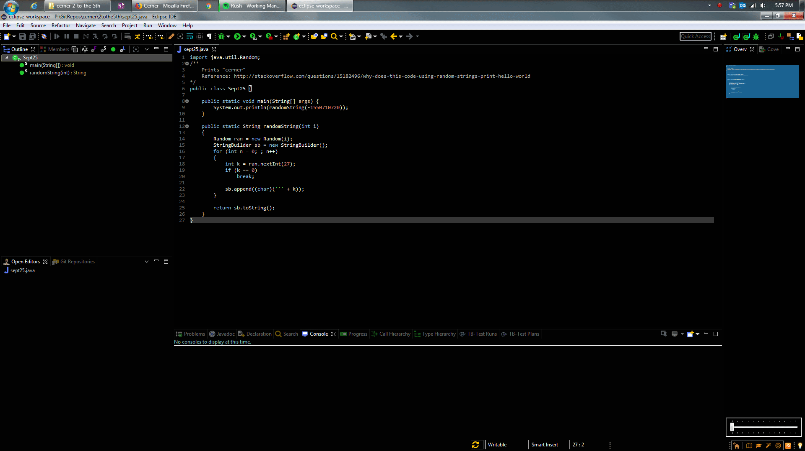

# EclipseFullScreen

This is a submission for Cerner's 2018 2^5 programming competition. This year's theme is "Engineering Productivity".

 Having my IDE in full screen helps me eliminate distractions and be more productive. Alt + F11 toggles full screen mode for Eclipse, however I do not like that Eclipse in full screen still has a menu bar. Since I use a dark theme, the menu bar was still too light for me, plus it took away precious vertical space. I sought for a way for hiding Eclipse's menu bar in full screen, but had no luck.

 I did find that I could simulate the full screen effect by having an identical java perspective but with the menu bar hidden. Progress! However, this required me to hit two short cut key combinations (Alt + F11 for full screen, Ctrl + F8 to change perspective) for me to get the desired effect. Of course, I'm too lazy for that. Thus, this AutoHotKey script was born.

 This seemed like the quickest and easiest way to get the result I wanted. Now I don't need to hit two different shortcut key combinations, I just need one, and the script does the rest. Two key combinations for the price of one! Now that's what I call productive! Results may vary. Satisfaction not guaranteed.
 

The <s>magic</s> script in action! I'm hitting Ctrl + Shift + F11. Trust me.

#### Line counts according to [cloc](https://github.com/AlDanial/cloc):

| Language | Blank Lines | Comments | Code |
| --- | ---: | ---: | ---: |
| AutoHotkey | 4 | 5 | 12 |

## Getting Started
Simply run the script and it should begin monitoring your global hotkeys.

## How to use
Hit Ctrl + Shift + F11. If Eclipse is open, it will make it the active window, and send Alt + F11 and Ctrl + F8 to Eclipse.

### Prerequisites

 * You will need [AutoHotKey](https://autohotkey.com/) to run the script.
 * [Eclipse](https://www.eclipse.org/downloads/)
 * Two identical perspectives, with one that has a hidden menu bar.
 * Ensure Ctrl + F8 is set to "Next Perspective"
 * Ensure Alt + F11 is set to "Toggle Full Screen"
