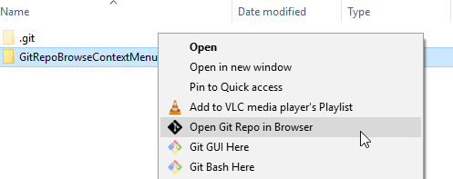

# GitRepoBrowseContextMenu

This is a submission for Cerner's 2018 2^5 programming competition. This year's theme is "Engineering Productivity".

This script adds a new context menu when right clicking on a directory or the background of a directory which gives a quick way to browse to a git repo in your default browser.

#### Line counts according to [cloc](https://github.com/AlDanial/cloc):

| Language | Blank Lines | Comments | Code |
| --- | ---: | ---: | ---: |
| DOS Batch | 11 | 14 | 24 |

## Getting Started

* Place the .bat file and optionally the .ico file in a directory where you want it to be installed.
 * If you don't want an icon on your menu, don't install with the .ico in the same directory. Alternatively, you can use your own .ico file.
* Run the .bat as administrator for it to install the registry keys needed for adding the context menu.

The script will create an uninstall file in the same directory which will just delete those registry keys. As long as you do not delete or move these .bat files, the new menu should work.

## How to use
Right click on any directory in windows explorer (or blank space inside a directory) and you will see "Open Git Repo in Browser".

As long as the directory is a git repo that has a valid URL (such as github), clicking on this should launch the git url in your default browser. Otherwise, nothing will happen (except you may see a flash of a command prompt window).

### Prerequisites

 * You will need git installed and in your PATH environment variable in order for git commands to be called from cmd.
 * A Windows operating system.
 * A git repository that is viewable in a browser, such as a github repo.
